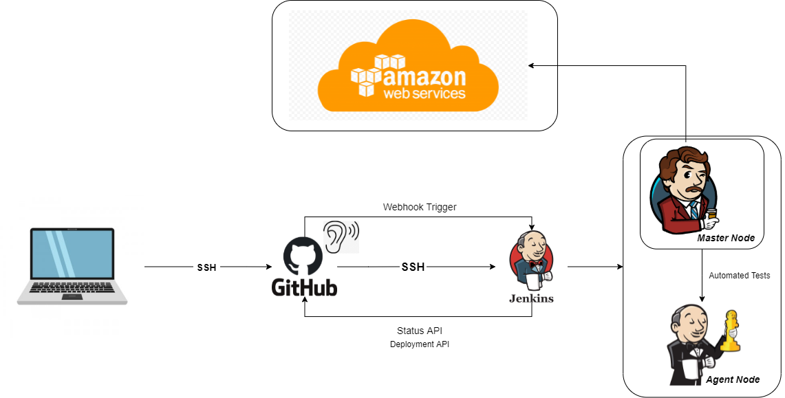
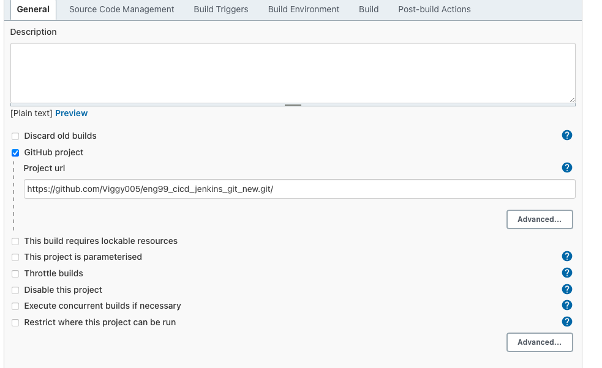
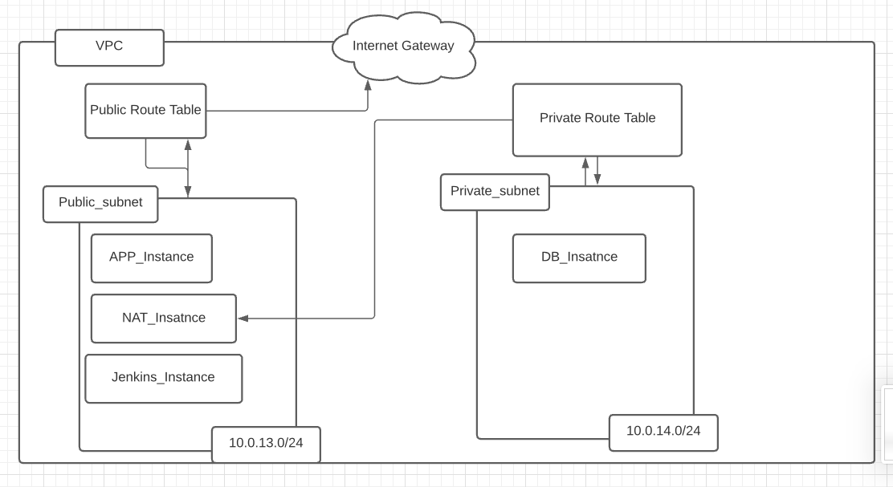

# CICD
# project Diagram:

## Github ssh set up
### Webhooks

# generate SSH:
-       for Github(public_key) to localhost(private_key)
-       for github(pub) to jenkins(privatekey)
>how to generate key:
-       cd .ssh (recomended places to generate and store keys)
-       ssh-keygen -t ed25519 -C "your_email@example.com"

# on github

# Job1 (check if app is good to go):

# Job2 (merge dev branch inot master/main):

# Job3 (launch DB into aws ec2):

# create own jenkins and run:

# Job4 (launch app into aws ec2):

